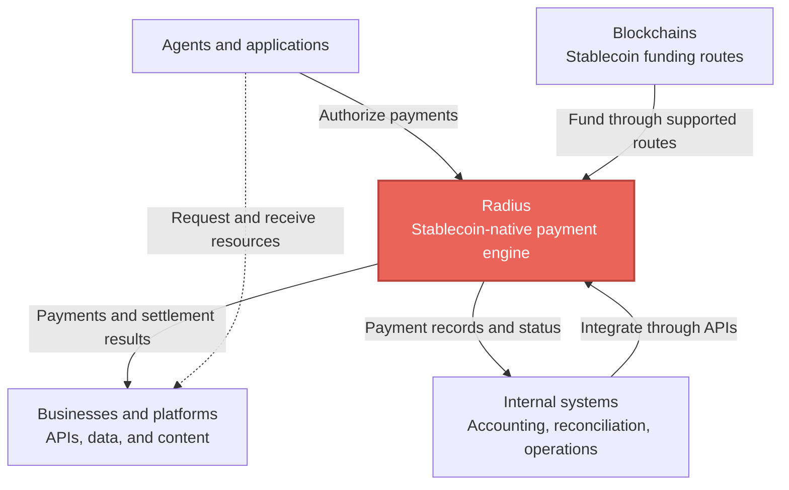
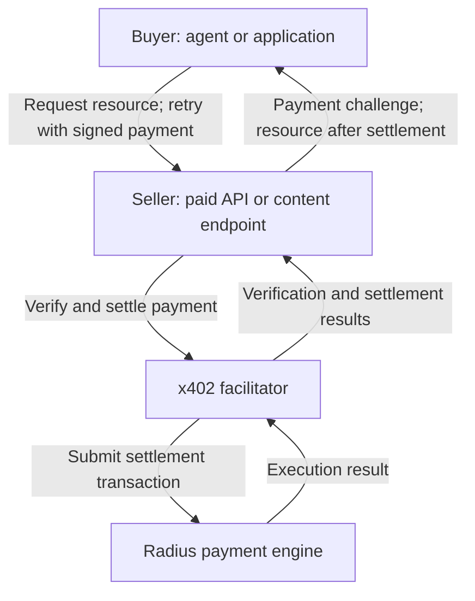
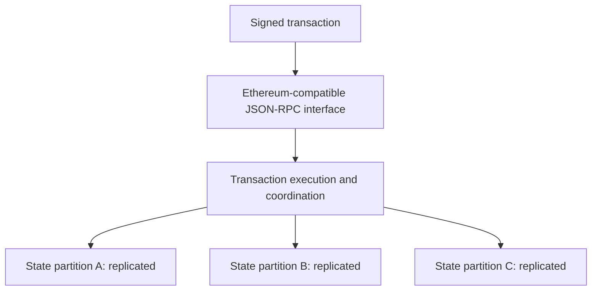

# Architecture [The payment engine in your ecosystem]

Radius is a stablecoin-native payment engine for agentic commerce. A buyer authorizes payment for a resource, Radius executes the payment, and the seller uses the settlement result to decide whether to deliver the resource.

## Radius in the ecosystem

Radius connects agents and applications that make payments with businesses that accept them. Blockchain funding routes move supported stablecoins into the payment environment, while internal systems use payment data for accounting, reconciliation, and operations.

This is an integration map: payment protocols and facilitators connect paid requests to Radius; bridges and funding services connect supported blockchain assets; your applications connect internal systems to payment records. See [funding routes](/build/bridge) and [integration interfaces](/reference/json-rpc/methods) for the implementation details.

The sections below follow the documented x402 flow, then explain the engine's execution and operating model.

## The payment flow

1. **Request:** The buyer asks the seller for a resource.
2. **Challenge:** The seller returns HTTP `402 Payment Required` with payment requirements, including the amount, asset, recipient, and environment.
3. **Authorize:** The buyer checks the requirements, signs payment data, and retries the request. The buyer's software determines which purchases it can authorize.
4. **Verify and settle:** The seller sends the payment data to a facilitator for verification and settlement on Radius. Verification checks the proposed payment; successful verification alone is not completed settlement.
5. **Deliver:** After successful settlement, the seller returns the resource. The settlement transaction can be inspected using the payment result's transaction reference.

`radius-sdk` implements steps 2–5 for both sides: see [Accept payments](/build/accept-payments) for the seller and [Make payments](/build/make-payments) for the buyer. The [x402 explanation](/build/x402) covers the protocol. The [facilitator API reference](/reference/facilitator-api) defines verification and settlement requests and responses.

## Component responsibilities

| Component                     | Responsibility                                                                               |
| ----------------------------- | -------------------------------------------------------------------------------------------- |
| Buyer and signer              | Authorize spending and sign payment data; enforce the buyer's payment policy                 |
| Paid endpoint                 | Define the price and recipient, require successful payment, and deliver the resource         |
| Facilitator                   | Verify payment data and submit settlement using the supported protocol and asset combination |
| Radius payment engine         | Execute the transaction and maintain payment state                                           |
| Integration's payment records | Associate the resource request with its settlement reference and delivery outcome            |

The facilitator connects the HTTP protocol to payment execution. The endpoint still controls access to the resource. A successful payment does not establish the quality of the data or grant usage rights beyond the seller's terms.

## Inside the payment engine

Radius partitions state across shards and processes independent transactions in parallel. Ethereum-compatible interfaces provide the entry point for transaction submission and queries.

A transaction accesses the state needed for its operation. Transactions against independent keys can run concurrently. Transactions that share keys must coordinate so their updates remain consistent. One transaction can access state across multiple partitions.

Partitioning distributes the working state. Replication within a partition provides fault tolerance. These serve different purposes: adding partitions creates room to distribute work, while replicas help preserve a partition's operation and data when a node fails.

Radius executes transactions without organizing execution into globally ordered blocks. Its Ethereum-compatible block-related interfaces have specific semantics documented in [Ethereum compatibility](/reference/ethereum-compatibility).

For more detail on state routing, shard replication, and handling contention, read [parallel execution and sharding](/architecture/parallel-execution).

## Scaling depends on the workload

Independent payments can benefit from parallel execution. Payments that repeatedly modify the same account or contract state create contention, even when other state is distributed across many partitions.

For example, sending every payment through one shared counter introduces a common key. Test the actual recipient and contract patterns your service uses, including retries and peak traffic. Adding capacity does not make a shared write dependency disappear.

Settlement latency is also only part of a paid request. The buyer experiences the initial request, challenge handling, signing, settlement, and resource delivery. Evaluate these together when deciding how payments fit an interactive API.

## Operating model and authorization

Radius is centrally operated payment infrastructure. The operator runs the engine, and shard replication provides fault tolerance within that operating model. Users rely on the operator for service operation and availability.

Signing controls authorization to spend. The integration determines who holds the signing key, what the buyer can purchase, and how limits are enforced. A per-request ceiling in one client does not enforce a cumulative budget or constrain other software with access to the same key.

## Settlement and delivery are separate outcomes

A payment can settle while the resource response times out. The transfer and the seller's HTTP response are not one atomic operation.

Keep the request identifier, settlement reference, and delivery outcome together. Before authorizing another charge after a timeout, determine whether the first payment completed. The seller needs a policy for recovering delivery or handling the exception. A receipt proves a payment outcome; it does not prove that the buyer received the resource.

## Assets, fees, and external funding

The asset deposited from another network, the asset transferred to a seller, and the asset used for execution fees can differ. Payment protocols and Ethereum-compatible interfaces do not make all assets interchangeable.

Use the [fee reference](/reference/fees) for the current fee and conversion behavior, [contract addresses](/reference/contract-addresses) for the selected environment, and the [bridge guide](/build/bridge) for documented funding routes. Confirm the output asset and withdrawal capacity separately from payment execution.

## Put the architecture to work

Read [Why Radius](/why-radius) to evaluate the product's fit. Follow [Accept payments](/build/accept-payments) to integrate the seller side, or [Make payments](/build/make-payments) to enable a buyer.
