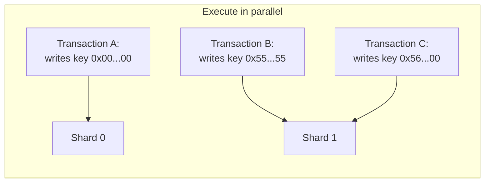
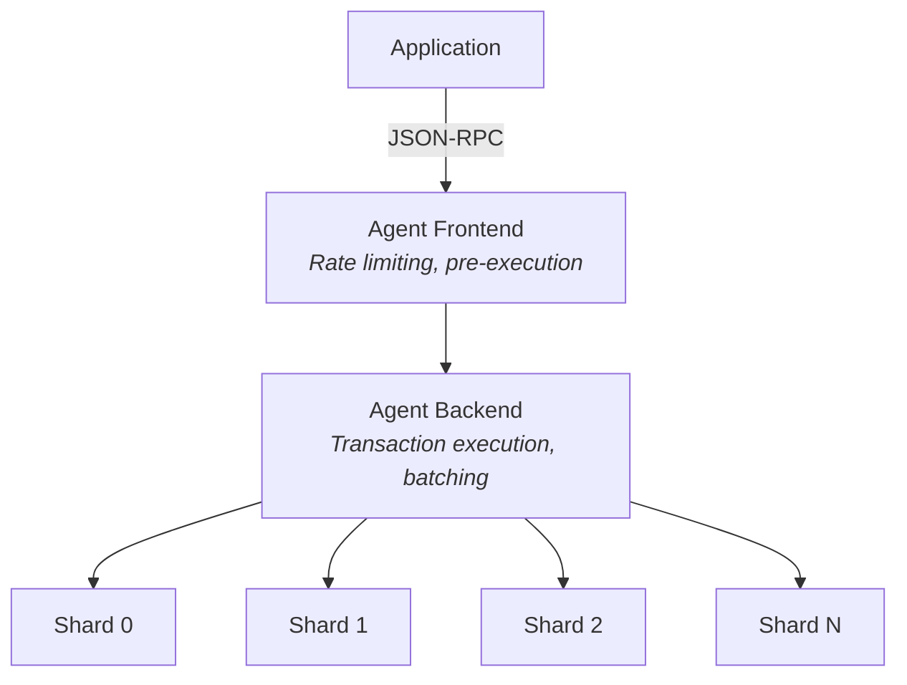
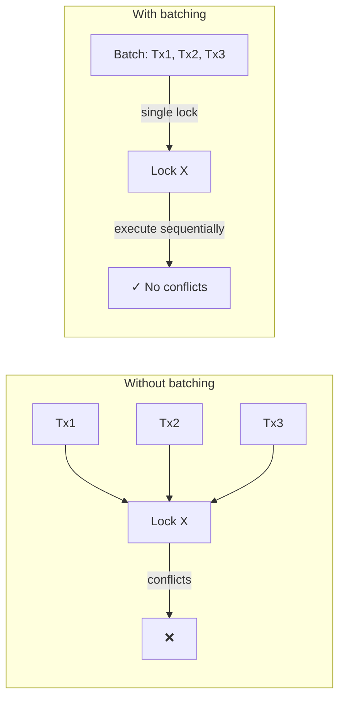

import { MAINNET_DASHBOARD_URL } from '../../constants';

# Architected for scale [Linear scalability with sharded state and parallel execution]

Radius scales by sharding state and executing transactions in parallel. Instead of forcing every node to process every transaction in sequence, Radius routes work to independent shard clusters.

## Why this scales

Traditional blockchains hit throughput limits because all validators process the full transaction stream. Radius partitions global state and executes independent transactions concurrently.

Each shard:

- Runs a three-node Raft cluster (tolerates one node failure)
- Stores a partition of global state
- Executes transactions independently when keys do not conflict

## How sharding works

### Partition state

Radius hashes keys and distributes them across shards with a prefix-tree routing model.

When capacity expands:

1. A new shard cluster starts.
2. The routing table updates keyspace ownership.
3. Keys migrate lazily on first access.
4. The old shard forwards lookups until migration completes.

### Execute in parallel

Transactions that touch different keys execute simultaneously. Only transactions that contend on the same keys require coordination.

## System architecture

Radius is based on [PArSEC](https://dci.mit.edu/s/p.pdf) (Parallel Sharded Transactions with Contracts).

## Why Radius does not use blocks for execution

Radius optimizes for payment throughput and low latency. It executes transactions as the atomic unit instead of batching transactions into globally ordered blocks.

This removes global block-consensus overhead and enables shard-local replication with Raft.

| Aspect      | Blockchains                            | Radius                                 |
| ----------- | -------------------------------------- | -------------------------------------- |
| Consensus   | Global (all nodes agree on each block) | Per-shard (Raft replication)           |
| Ordering    | Sequential block ordering              | Parallel across independent shards     |
| Propagation | Broadcast blocks network-wide          | Route writes directly to target shards |
| Finality    | Probabilistic (confirmations)          | Deterministic after one Raft commit    |

## Congestion control for hot keys

When many transactions target the same key, Radius batches conflicting transactions to reduce lock churn.

1. **Detect:** Shards identify high-conflict keys.
2. **Route:** Frontend sends conflicting traffic to one backend.
3. **Batch:** Backend executes the batch sequentially under one lock.
4. **Release:** Lock is released after ordered execution completes.

## Live metrics

Track real-time performance on <a href={MAINNET_DASHBOARD_URL}>Radius network dashboard</a>.

## Next steps

- [Designed for the Internet of Tomorrow](/architecture/execution-and-compatibility) — EVM compatibility and behavior differences
- [JSON-RPC API](/reference/json-rpc/methods) — Method-level reference
- [Claim and transact](/build/claim-and-transact) — Go from zero to your first transaction
